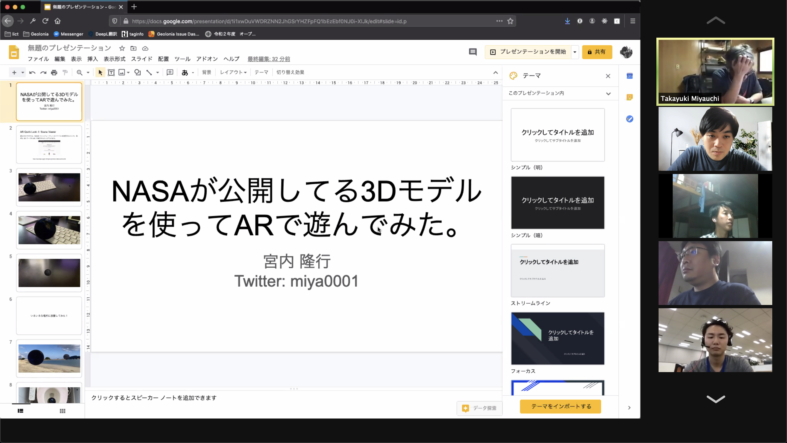

NASA International Space Apps Challenge in Kushimoto の受賞チームが決定しました。

## 総合優勝 / グローバルアワードノミネート & 審査員特別賞 / 衛星データプラットフォームTellus オウンドメディア「宙畑」編集長　中村友弥

<table class="table table-award">
<tbody>
<tr><th scope="row">チーム名</th><td>チームDANGO SAT</td></tr>
<tr><th scope="row">メンバー</th><td>川瀬素生、山本三七男、川端進、井上実柚</td></tr>
<tr><th scope="row">タイトル</th><td>衛星データを使った発展途上国の最適な避難場所解析アプリの開発及び最適避難場所探査用缶サットの開発</td></tr>
<tr><th scope="row">スライド</th><td><a href="https://github.com/Miyubus350/DangoSat/blob/main/presentations/DangoSat_Japanese.pdf">https://github.com/Miyubus350/DangoSat/blob/main/presentations/DangoSat_Japanese.pdf</a></td></tr>
</tbody>
</table>

## 審査員特別賞 / 大阪電気通信大学 情報通信工学部 情報工学科 教授 古崎 晃司

<table class="table table-award">
<tbody>
<tr><th scope="row">チーム名</th><td>利眼流(RiGanRyu)</td></tr>
<tr><th scope="row">メンバー</th><td>谷口、小山、伊藤、仁木、畑下</td></tr>
<tr><th scope="row">タイトル</th><td>「お盆に泳いだら海に引きずり込まれる」を防ぎます。</td></tr>
<tr><th scope="row">スライド</th><td><a href="https://github.com/Rigunryu/presentation/blob/main/pdf/Team%20_%20%E5%88%A9%E7%9C%BC%E6%B5%81_ja.pdf">https://github.com/Rigunryu/presentation/blob/main/pdf/Team _ 利眼流_ja.pdf</a></td></tr>
</tbody>
</table>

## 参加チーム

<table class="table table-award">
<tbody>
<tr><th scope="row">チーム名</th><td>SpaceSleeper</td></tr>
<tr><th scope="row">メンバー</th><td>平井星斗、若林 健一</td></tr>
<tr><th scope="row">タイトル</th><td>宇宙食レコメンデーションサービス</td></tr>
<tr><th scope="row">スライド</th><td><a href="https://docs.google.com/presentation/d/14H2pI0rqtsy6NmpvXSw0TfXz_KxjYyGnXYeFc2Rw9vw/edit?usp=sharing">https://docs.google.com/presentation/d/14H2pI0rqtsy6NmpvXSw0TfXz_KxjYyGnXYeFc2Rw9vw/edit?usp=sharing</a></td></tr>
</tbody>
</table>

<table class="table table-award">
<tbody>
<tr><th scope="row">チーム名</th><td>チーム宮内</td></tr>
<tr><th scope="row">メンバー</th><td>宮内隆行</td></tr>
<tr><th scope="row">タイトル</th><td>NASAが公開している3Dモデルを使ってARで遊んでみた。</td></tr>
<tr><th scope="row">スライド</th><td><a href="https://docs.google.com/presentation/d/1i1xwDuVWDRZNN2JhGSrYHZFpFQ1bEzEbf0NJ0i-XIJk/edit?usp=sharing">https://docs.google.com/presentation/d/1i1xwDuVWDRZNN2JhGSrYHZFpFQ1bEzEbf0NJ0i-XIJk/edit?usp=sharing</a></td></tr>
</tbody>
</table>
